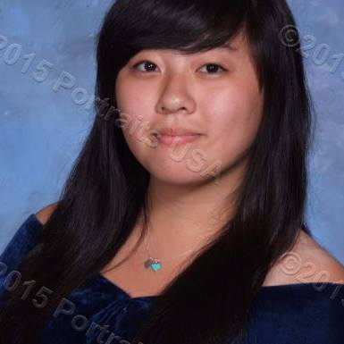
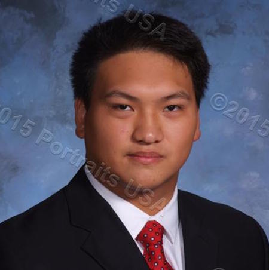

# A.D. - Attempting Defusal

## Group Members
|     | **Member** | **Github** |
|-----|:------------:|:------------:|
|  |Angela Chan | [`@angelachan64`] (https://github.com/angelachan64) |
|  |Dillon Zhang | [`@dillzhang`] (https://github.com/dillzhang) |

##How to Compile
```
make
make run
```

##How to Use
1. Compile
2. Run

##Necessary Files
- `main.c`